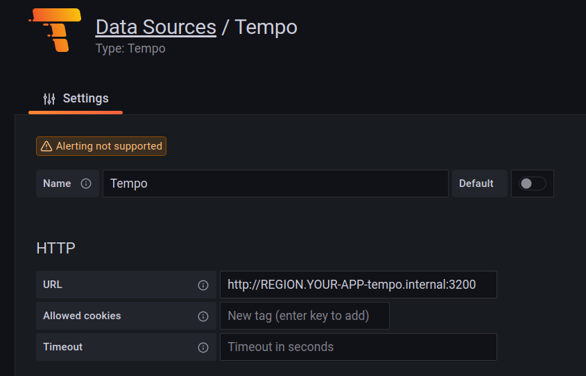
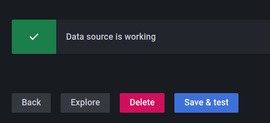
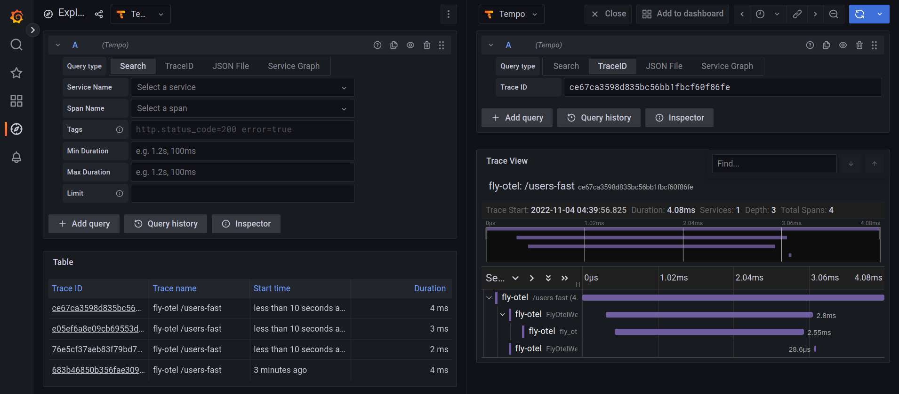
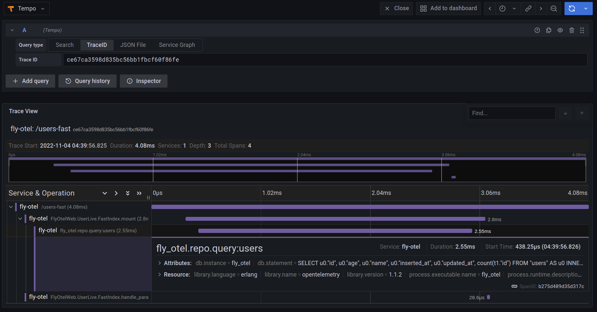
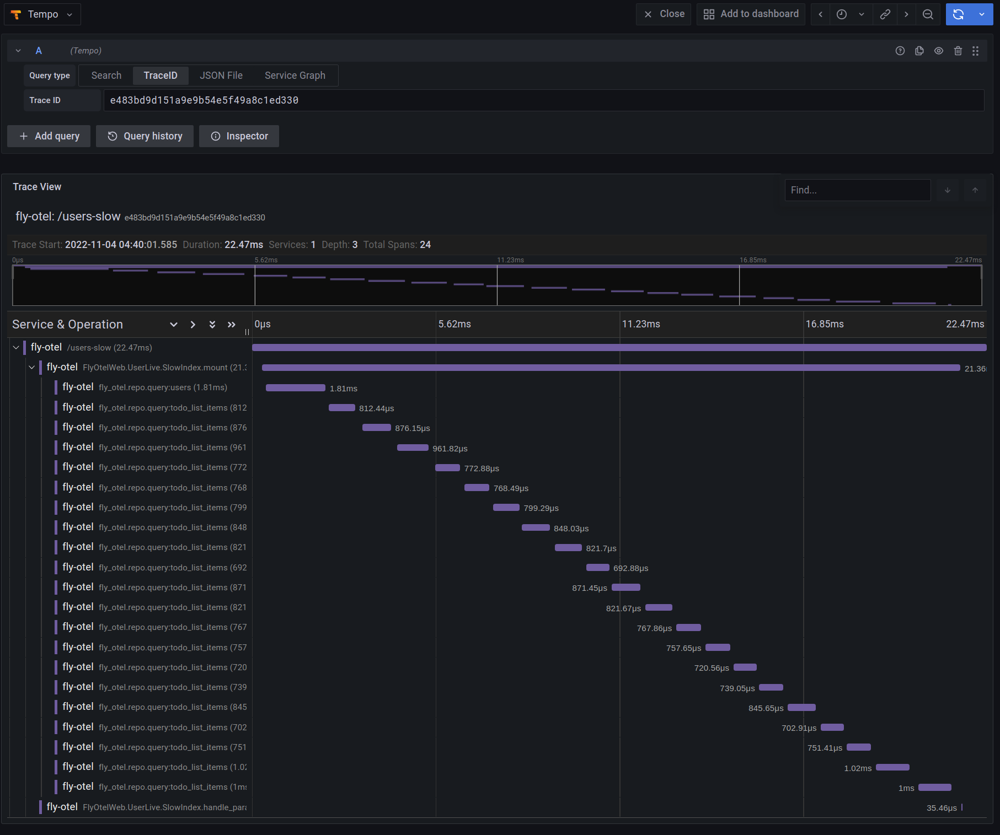
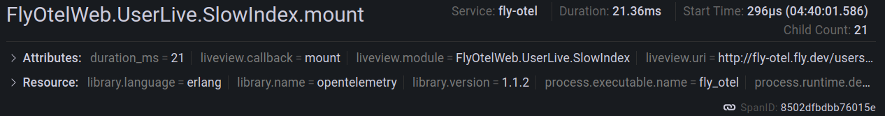

# Elixir, OpenTelemetry, and the Infamous N+1

## Introduction

In this article, we'll dive into the topic of observability and specifically the [OpenTelemetry project](https://opentelemetry.io/). We'll see
how to set up the Elixir and [Erlang OpenTelemetry](https://github.com/open-telemetry/opentelemetry-erlang) libraries in a Phoenix LiveView application so you can debug troublesome database queries. We'll also see how this application can be deployed to Fly.io along with [Grafana](https://grafana.com/) and
[Tempo](https://grafana.com/oss/tempo/) so we can store and query our sample traces. Before diving into the nitty-gritty, let's first get a sense
for the application observability landscape.

As software engineers, it is crucial that we have insight into our running applications. This is especially true when
we have customers paying-for and depending-on our products. As a customer and user, there are few things more
frustrating that trying to get your work done and some SaaS product that you pay for is currently unavailable or running
extremely slow. As a business, we may be able to get away with some down-time and slow services here and there, but if
it becomes the norm, the customer-experience deteriorates to the point where customers start looking elsewhere.

But don't worry - it's not all doom and gloom! As software engineers, there are plenty of tools at our disposal that
enable us to provide the best customer experience possible. For example, as we develop a piece of software, we can write unit, integration, end-to-end and stress tests to ensure that features are implemented properly and that they
continue to work tomorrow even though the codebase is constantly changing. These tools work great for local development
and CI/CD... but what do you do when the application is running in production and we encounter issues? To answer
that question, we'll need to reach for tools that fall under the observability umbrella.

## The Three Pillars of Observability

In the context of software, observability is the ability to inspect and understand a running application. In order to
introspect an application we need to extract some data from while it is running without hindering its ability to
service user requests. Observability tooling that interferes with an application's natural ability to service requests
is not viable in production as it impacts our customers in undefined ways. So how do we extract data from a
running application in such a way?

The three most common ways to achieve this are logging, metrics and traces.
Combined, they create the three pillars of observability and allow us to effectively analyze and debug our production
applications and systems. Let's briefly look at what each of these pillars does for us to get a sense for how they work
together to give us application observability:

- **Logs:** Logs contain detailed information as to what events are taking place within an application. Logs can be either
  structured (JSON for example) or unstructured (free text).

- **Metrics:** Metrics are measurements of your application over time and can contain a few bits of metadata to enrich the
  measurements and give them more context.

- **Traces:** Traces are a collection of related events with each event containing metadata as to what happened and for how
  long. Traces can span across call stacks on a single machine and even across services via distributed tracing.

In this article, we'll focus on the tracing observability pillar. Specifically, we'll see how we can leverage
the OpenTelemetry tracing tooling to identify performance issues in an Elixir Phoenix LiveView application. 

Let's dive into OpenTelemetry. We'll start with what it is and how we can use it in our LiveView application.

## Configuring OpenTelemetry in Elixir

OpenTelemetry (often abbreviated to OTel), is a collection of open source standards for how logs, metrics, and traces
should be collected and exported from services. By design, it is a programming language agnostic standard and there are
implementations of the [OTel standard in a lot of programming
languages](https://opentelemetry.io/docs/getting-started/dev/) already including Erlang and Elixir!

At a high level, the [OTel standard specifies a few different
components](https://opentelemetry.io/docs/concepts/components/) that need to be available in order to ship logs, metrics
and traces from your applications. The API and SDK components are what we lean on when we instrument our
application with the tracing library for Ecto for example. The collector component, is what that Ecto tracing library
ships telemetry data to, which, in turn, exports that telemetry data to Jaeger, Tempo, or whatever we choose to
use to persist sample traces.

Luckily, instrumenting your Elixir applications isn't too hard thanks to all of the hard work done by the contributors
to the [Hex OpenTelemetry organization](https://hex.pm/orgs/opentelemetry). For this article, we'll look at a sample
TODO list LiveView application that has two routes of interest. `/users-fast` and `/users-slow` both list all of the
users of the application and also list how many TODO list items each of them have in their queue. As the names of the
routes imply, one of the routes responds quickly, and the other not so much. The question that we need to answer is why
is this occurring and how we can remedy the problem. The title of the article hints at the problem... but it'll really be clear once we see a trace from the application when the
`/users-slow` route.

All the code of the sample application can be found [here](NEED PUBLIC GIT_HUB - TODO: Transfer to `fly-apps` org?) but let's start by going through the
application specific changes needed to instrument our application. As a note, this demo
application was generated via the `mix phx.new APP_NAME --binary-id` command, with only a few changes made to support
deploying to Fly.io. Let's first cover how to set up the OpenTelemetry libraries by opening up `mix.exs` and adding the
following dependencies:

```elixir
defp deps do
  [
    ...
    {:opentelemetry_exporter, "~> 1.0"},
    {:opentelemetry, "~> 1.0"},
    {:opentelemetry_api, "~> 1.0"},
    {:opentelemetry_ecto, "~> 1.0"},
    {:opentelemetry_liveview, "~> 1.0.0-rc.4"},
    {:opentelemetry_phoenix, "~> 1.0"},
    {:opentelemetry_cowboy, "~> 0.2"}
  ]
end
```

After that, we run `mix deps.get` to fetch the dependencies from Hex. Next, we'll open up `application.ex` and update the `start/1` callback as follows:

```elixir
def start(_type, _args) do
  if System.get_env("ECTO_IPV6") do
    :httpc.set_option(:ipfamily, :inet6fb4)
  end

  :ok = :opentelemetry_cowboy.setup()
  :ok = OpentelemetryPhoenix.setup()
  :ok = OpentelemetryLiveView.setup()

  :ok =
    FlyOtel.Repo.config()
    |> Keyword.fetch!(:telemetry_prefix)
    |> OpentelemetryEcto.setup()

  ...
end
```

The `if-block` in the beginning checks for the presence of the `ECTO_IPV6` environment variable prior to setting an
`:httpc` option. The reason for this being that when applications are deployed to Fly.io, they are interconnected
by a mesh of [IPv6 Wireguard tunnels](https://fly.io/docs/reference/private-networking/), and by default
the Erlang HTTP client `:httpc` is configured to use IPv4. In order for our OTel exporter to publish our traces to Tempo
it needs the `:inet6fb4` option set so that it first attempts to connect to the remote host via IPv6, while falling
back to IPv4 if needed. We lean on the `ECTO_IPV6` environment variable since Ecto is also configured to apply this
`socket_options` if the environment variable is present (look at the `config/runtime.exs` if you are interested in
seeing how this is set up).

Next we have a few Opentelemetry library calls that configure the trace collectors. The first three `setup/0` calls set
up the Cowboy, Phoenix, and LiveView tracing libraries. These calls instruct the OTel libraries to attach handlers to
the telemetry events that are emitted by each of the underlying libraries. The Ecto tracing library requires a little
more work to set up as we need to fetch the configured telemetry prefix so the OTel library can attach the handler
to the correct Repo event.

With that in place, all that needs to be done now is update some configuration in `runtime.exs` so the
telemetry exporter knows where to send trace data. Add the following inside of the `config_env() == :prod` if-block:

```elixir
if config_env() == :prod do
  config :opentelemetry_exporter,
    otlp_protocol: :http_protobuf,
    otlp_endpoint: System.fetch_env!("OTLP_ENDPOINT")

  ...
end
```

With this in place, we can configure our application at runtime to send traces to the correct
service. In this example, we will lean on Tempo to capture and persist traces. Once the traces are in Tempo, we
can use Grafana to explore the persisted traces and see why our endpoints differ in performance.
Hopefully, it's clear that there is not a lot of ceremony or effort needed on our part to start collecting traces from our
application.

Next, we'll deploy our application to Fly.io so we can capture and view some real traces!

## Deploying and Observing Your Application on Fly.io

Let's start by installing the `flyctl` CLI utility and authenticating with Fly.io so we can start deploying our services
using the following guide: https://fly.io/docs/hands-on/install-flyctl/.

With that done, you are ready to start deploying all of the necessary services including our trace enabled Phoenix
LiveView application. Let's begin by deploying our Phoenix application.

### Phoenix App + Postgres

To deploy the instrumented Phoenix LiveView application, we first need to update the `fly.toml` file to reflect the name
of the application. Specifically, we need to update the following fields:

- Update the `OTEL_RESOURCE_ATTRIBUTES` environment variable to have the correct `service.name` value for your service.
- Update `OTLP_ENDPOINT` environment variable to have the correct URL for the Tempo service. The URL will have the
  following format: `http://REGION.YOUR-APP-tempo.internal:4318` where `REGION` is one of the [Fly.io datacenter regions](https://fly.io/docs/reference/regions/).
- Update the `PHX_HOST` environment variable to reflect the URL for the application based on the application name.

With those fields updated, you can run `fly launch` and let the Fly.io CLI tool do the heavy lifting. Be sure to create
a Postgres database when prompted so your application has something to communicate with. After the application is up and
running, we'll want to hydrate the database with some data. Connect to the running instance by running 
`flyctl ssh console` in the CLI. After you connect to the Phoenix LiveView application, go ahead and run 
`/app/bin/YOUR_APP REMOTE` to attach an IEx session to the live application. After connecting to the application, run the following snippet of Elixir code to populate the database with some initial data:

```elixir
alias Faker.Person
alias Faker.Lorem

alias FlyOtel.Accounts
alias FlyOtel.Accounts.TodoListItem
alias FlyOtel.Accounts.User

1..20
|> Enum.each(fn _ ->
  {:ok, %User{} = user} =
    Accounts.create_user(%{
      age: Enum.random(18..65),
      name: "#{Person.first_name()} #{Person.last_name()}"
    })

  1..Enum.random(5..50)
  |> Enum.each(fn _ ->
    {:ok, %TodoListItem{}} = Accounts.create_todo_list_item(%{task: Lorem.sentence()}, user)
  end)
end)
```

With that done, we can vist the application in a browser (`https://YOUR-APP.fly.dev/users-fast`) to see it in
action! 

Next we'll deploy Tempo to store all of the traces that our collector exports.

### Tempo

To run Tempo in Fly.io, we need to create our own Docker container (built upon the Gradana Tempo image) that includes our necessary configuration file.
The following Dockerfile is the bare minimum required to deploy Tempo to Fly.io and will probably need
some more work and configuration if you want to set this up for production:

```dockerfile
FROM grafana/tempo:1.5.0

COPY ./tempo-config.yaml /etc/tempo.yaml

CMD ["/tempo", "-config.file=/etc/tempo.yaml"]
```

In that short Dockerfile, it mentioned `tempo-config.yaml`. We'll create the file to copy into the Dockerfile and configure how Tempo listens for trace data and how to store the data. Similar to the Dockerfile, this is the minimum requirement to get Tempo up and running and for a production application some additional configuration might be needed. The contents of the YAML file are:

File: `temp-config.yaml`

```yaml
server:
  http_listen_port: 3200

search_enabled: true

distributor:
  receivers:
    otlp:
      protocols:
        http:
          endpoint: "0.0.0.0:4318"

storage:
  trace:
    backend: local
    block:
      bloom_filter_false_positive: .05
      index_downsample_bytes: 1000
      encoding: zstd
    wal:
      path: /tmp/tempo/wal
      encoding: snappy
    local:
      path: /tmp/tempo/blocks
    pool:
      max_workers: 100
      queue_depth: 10000
```

With the Dockerfile and configuration located in the same directory, all we need is a `fly.toml` file in
the same directory so we can deploy Tempo. The contents of the `fly.toml` file should contain the following:

```toml
app = "YOUR-APP-tempo"

[build]
dockerfile = "./Dockerfile"
```

For those familiar with deploying services on Fly.io, they may wonder why there is no `[[services]]` section. The reason
is, we don't want this service accessible from the public internet. We only want it available internally on our network for Grafana and our Phoenix
application to communicate with.

With that all in place, all that is left is to run `flyctl apps create YOUR-APP-tempo && flyctl deploy` in the directory
with all of the files and Tempo should be deployed! 

With that going, let's deploy Grafana next.

### Grafana

Like how we deployed Tempo, we'll create a new directory to house the Dockerfile, Grafana config, and Fly.io
deployment manifest. Again, the Dockerfile is simple and copies in a configuration file and starts
Grafana:

```dockerfile
FROM grafana/grafana:9.2.3

COPY ./grafana.ini /etc/grafana/grafana.ini

CMD ["/run.sh"]
```

Our configuration file contains a flag to enable the experiment Tempo search functionality. We use this in Grafana
to help easily find relevant traces for our application:

File: `grafana.ini`

```ini
[feature_toggles]
enable = tempoSearch tempoBackendSearch
```

With that ready, we just need the `fly.toml` file:

File: `fly.toml`

```toml
app = "YOUR-APP-grafana"

[build]
dockerfile = "./Dockerfile"
```

Once again, we run `flyctl apps create YOUR-APP-grafana && flyctl deploy` to get
Grafana up and running on Fly.io. Also, note the file exposes no services on the public internet. Basically, it's fairly simple (and secure) to connect to internal applications running on Fly.io via Wireguard
using `flyctl`. This limits our exposed surface area on the public internet which is always a good things from a security
standpoint. 

Let's connect to Grafana after it is deployed and configure our Tempo data source so we can visualize
application traces.

#### Configuring Tempo Datasource in Grafana

From inside the directory containing the Grafana `fly.toml` manifest, run the following command:

```session
$ flyctl proxy 3000:3000
```

Now, open a browser and navigate to `http://localhost:3000` to access your Grafana instance (by
default, the username and password are both `admin`)! After logging in, go to the data source configuration page 
(`http://localhost:3000/datasources`) and click the `Add data source` button. After that, look for Tempo in the list of
available data sources (under `Distributed tracing`) and select it. On the next page, the only field we need
to fill out is the `URL` field. We want to fill it out as shown below (substituting `REGION` with the region
where the Tempo instance is running and substituting `YOUR-APP` with the name given to Tempo when it was created):



If all goes well, after clicking `Save & test`, we should see a success message:



With Grafana running and connected to Tempo, all that is left is to exercise the Phoenix application a little and 
compare the trace results! Navigate a few times to `https://YOUR-APP.fly.dev/users-fast` and
`https://YOUR-APP.fly.dev/users-slow` to ensure that there is trace information in Tempo and then click on the `Explore`
button in the side nav in Grafana.

## Comparing the Application Traces

By default, the selected data source should be Tempo, but if it is not, be sure to select it. Then, in the row of filters
labeled `Query type`, select `Search`. After that, select `/users-fast` from the `Span Name` drop down and click on one
of the returned `Trace ID`s. After clicking on a trace sample, we should see something like this:



We can even click on individual trace segments to drill down and see what metadata is associated with the event:



As a comparison, now select `/users-slow` from the `Span Name` drop down and see how the trace compares. It should appear
something like this:



As we can see, not only is this trace visually busier than the previous trace but it is also much slower (22.47ms
duration versus 4.08ms duration from the previous trace). When we expand the trace segments, we can see that the same Ecto
queries keep getting executed over and over again inside of the LiveView `mount/3` callback whereas the previous trace
only has a single Ecto query executed. This right here is a visual representation of the infamous N+1 query in action!

Looking closely at the trace metadata from the slow trace, we can see that it starts off by making one call to
`fly_otel.repo.query:users` and then makes numerous repeated calls to `fly_otel.repo.query:todo_list_items`. In this
case the one call to the users is the `1` in `N+1` and the `N` is the 20 other calls that the backend had to make to the
database to get the TODO list for each and every user (which is supported by the `Child Count` value of `21`):



And just like that, we can now visualize and diagnose less than ideal database interactions all the way down the call
stack.

## Conclusion

Well done and thanks for sticking through to the end! We covered quite a lot of ground and hopefully you picked up a
couple of cool tips and tricks along the way. 

To recap, we learned about the various pillars of observability and took a
deep dive into the tracing pillar. We learned about setting up an Elixir application with the OpenTelemetry tooling and
even deployed our application along with some supporting monitoring tools to Fly.io. We then compared trace results
between two different LiveView pages and were able to see the effects that an N+1 query would have on our application's
performance.
